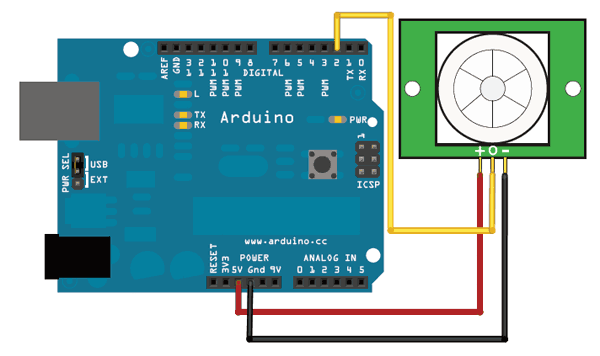

# Digital Sensor Library for Arduino
   

## What is it

This library (with examples) is designed to be integrated in projects using any kind of digital sensor (PIR, sound, piezoelectric, switch, button, ...).
It retrieves sensor state with status() (synchronously). It is also possible to attach your own function to sensor state change (asynchronously with interrupt).

## How to install

1) Download <a target="_blank" href="https://github.com/QuentinCG/Arduino-Digital-Sensor-Library/releases/download/1.0.0/DigitalSensor_v1_0_0.zip">latest release</a>

2) On your Arduino IDE, click "Sketch" menu and then "Include Library > Add .ZIP Libraries"

3) You can now use the library for your project or launch an example ("File > Examples")

## How to connect PIR sensor to your Arduino (sensor used in examples)

PIR sensors have a digital output and a power source entry:

|PIR Sensor|Arduino                      |
|--------  |--------                     |
|VCC       |5V                           |
|GND       |GND                          |
|D0        |D2 (or any other digital pin)|

Important note: If you want to use asynchronous feature of this lib (interrupt), you need to connect the sensor digital output to <a target="_blank" href="https://www.arduino.cc/en/Reference/AttachInterrupt">interrupt compatible pin</a>.

(<a target="_blank" href="https://learn.adafruit.com/pir-passive-infrared-proximity-motion-sensor/using-a-pir">Source image</a>)

## Examples

Two examples are provided with this library:

### Show PIR state every second (synchronous)

<a target="_blank" href="https://github.com/QuentinCG/Arduino-Digital-Sensor-Library/blob/master/examples/BasicPIR/BasicPIR.ino">Link to source code</a>

### Show PIR state when it changes (asynchronous with interrupt)
<a target="_blank" href="https://github.com/QuentinCG/Arduino-Digital-Sensor-Library/blob/master/examples/PIRWithInterrupt/PIRWithInterrupt.ino">Link to source code</a>

## License

This project is under MIT license. This means you can use it as you want (just don't delete the library header).

## Contribute

If you want to add more examples or improve the library, just create a pull request with proper commit message and right wrapping.
